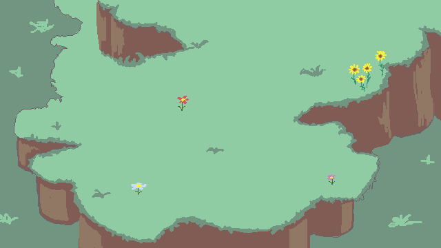

# WHISPIN SOKOBAN

Projet de deuxième semestre de L2 réalisé en groupe (6 personnes) : une implémentation moderne du jeu classique **Sokoban** avec interface graphique JavaFX.



## 📖 Description du Jeu

Sokoban est un jeu de réflexion où le joueur doit pousser des caisses vers des emplacements cibles dans un entrepôt. Le personnage ne peut que pousser les caisses, jamais les tirer, ce qui rend certains niveaux particulièrement difficiles !

### Fonctionnalités principales

- **Interface graphique JavaFX** avec animations fluides
- **10 niveaux** de difficulté progressive
- **Système de sauvegarde** automatique et manuelle (JSON)
- **Sélection de personnage** personnalisable (3 personnages disponibles)
- **Menu principal** complet avec navigation clavier
- **Écran de victoire** avec animation de feux d'artifice
- **Règles du jeu** intégrées
- **Gestion des niveaux** avec chargement depuis fichiers texte

## 🎮 Contrôles

| Touche | Action |
|--------|--------|
| `↑` `↓` `←` `→` ou `Z` `Q` `S` `D` | Déplacer le personnage |
| `Entrée` / `Espace` | Valider une sélection (menu) |
| `Échap` | Retour au menu / Annuler |
| `F1` | Afficher les règles |
| `F5` | Redémarrer le niveau |

## 🚀 Installation et Compilation

### Prérequis

- **Java 17+** installé sur votre système
- **JavaFX** installé (fourni dans le dossier `lib/`)
- **Make** (optionnel, pour utiliser le Makefile)

### Bibliothèques requises

Le projet utilise les bibliothèques suivantes (déjà incluses dans `lib/`) :

- **Jackson** (pour la persistance JSON) :
  - `jackson-core-2.17.2.jar`
  - `jackson-databind-2.17.2.jar`
  - `jackson-annotations-2.17.2.jar`
  
- **JavaFX** :
  - `javafx.controls.jar`
  - `javafx.fxml.jar`
  - `javafx.graphics.jar`
  - `javafx.base.jar`
  - `javafx.media.jar`
  - `javafx.swing.jar`
  - `javafx.web.jar`

### Compilation avec Make

```bash
# Compiler le projet
make build

# Lancer le jeu
make run

# Créer un fichier JAR
make jar

# Nettoyer les fichiers compilés
make clean
```

### Compilation manuelle

```bash
# Créer le dossier de compilation
mkdir -p bin

# Compiler tous les fichiers sources
javac --module-path lib --add-modules javafx.controls,javafx.fxml \
      -cp "lib/*" -d bin $(find . -name "*.java" -not -path "./bin/*")

# Lancer le jeu
java --enable-native-access=javafx.graphics \
     --module-path lib \
     --add-modules javafx.controls,javafx.fxml \
     -cp "bin:lib/*" InterfacePrincipale
```

## 📁 Structure du Projet

```
whispin-sokoban/
├── assets/                 # Ressources graphiques
│   ├── fond_ecran.png      # Image de fond d'écran
│   ├── player/             # Sprites des personnages
│   │   ├── p0/             # Personnage 1 (boy)
│   │   ├── p1/             # Personnage 2
│   │   └── p2/             # Personnage 3
│   └── tiles/              # Tuiles du jeu
│       ├── wall.png        # Mur
│       ├── grass.png       # Sol
│       ├── water.png       # Eau
│       ├── earth.png       # Terre
│       ├── tree.png        # Arbre
│       ├── portal.jpg      # Portail
│       ├── rain.png        # Pluie
│       └── pngegg.png      # Cible
├── niveau/                 # Fichiers de niveaux (niveau_01.txt à niveau_10.txt)
├── sauvegardes/            # Sauvegardes automatiques et manuelles
├── lib/                    # Bibliothèques tierces (Jackson, JavaFX)
├── bin/                    # Fichiers compilés (généré)
├── makefile                # Script de compilation
├── README.md               # Ce fichier
└── *.java                  # Code source Java (~50 classes)
```

## 🏗️ Architecture du Code

### Classes principales

| Classe | Description |
|--------|-------------|
| `InterfacePrincipale` | Point d'entrée JavaFX et gestion de l'interface principale |
| `LogiqueSokoban` | Moteur de jeu : déplacements, poussée de boîtes, détection de victoire |
| `ControleurPartie` | Contrôleurs des actions de jeu et interactions utilisateur |
| `ChargeurNiveau` | Chargement des niveaux depuis fichiers texte |
| `ServicePersistance` | Gestion des sauvegardes (lecture/écriture JSON) |
| `Case` et dérivés | Représentation des différents types de cases (mur, vide, boîte, cible, etc.) |
| `Animation` | Gestion des animations de déplacement du personnage |
| `FeuArtifice` | Animation de victoire |
| `Menu` | Création et gestion du menu principal |
| `NavigationClavierUI` | Navigation clavier dans les interfaces |

### Système de cases

Le jeu utilise un système de classes pour représenter les différents éléments :

- `CaseVide` - Case vide
- `CaseMur` - Mur infranchissable
- `CaseBoite` - Boîte à pousser
- `CaseCible` - Emplacement cible
- `CasePersonnage` - Position du joueur
- `CaseBoiteMonde` - Boîte dans un monde alternatif
- Et leurs combinaisons (`CaseBoiteCible`, `CasePersonnageCible`, etc.)

## 🎯 Format des Niveaux

Les niveaux sont stockés dans des fichiers texte avec le format suivant :

```
A 6
######
#@   #
# $$ #
# .. #
#    #
######
```

- **Première ligne** : Identifiant du monde + taille (ex: `A 6`)
- **Caractères spéciaux** :
  - `#` : Mur
  - `@` : Joueur
  - `$` : Boîte
  - `.` : Cible
  - `*` : Boîte sur cible
  - `+` : Joueur sur cible
  - (espace) : Case vide

## 💾 Système de Sauvegarde

Le jeu propose deux types de sauvegarde :

1. **Sauvegarde automatique** : Effectuée régulièrement pendant le jeu
2. **Sauvegarde manuelle** : Via le menu de sauvegarde

Les sauvegardes sont stockées au format JSON dans le dossier `sauvegardes/` avec les métadonnées suivantes :
- Version du format de sauvegarde
- Type de sauvegarde
- Niveau actuel
- Horodatage
- État du plateau

## 👥 Personnages

Trois personnages sont disponibles, chacun avec ses propres animations de déplacement :
- **Personnage 1** : Un garçon (dossier `p0/`)
- **Personnage 2** : (dossier `p1/`)
- **Personnage 3** : (dossier `p2/`)

La sélection se fait via l'écran de choix de personnage accessible depuis le menu.

## 🔧 Variables d'environnement

Le Makefile accepte les variables suivantes :

| Variable | Description | Valeur par défaut |
|----------|-------------|-------------------|
| `JAVAFX_LIB` | Chemin vers les bibliothèques JavaFX | `/usr/share/openjfx/lib` |
| `JAVAFX_MODULES` | Modules JavaFX à charger | `javafx.controls,javafx.fxml` |
| `JAVA_RUN_OPTS` | Options JVM pour l'exécution | `--enable-native-access=javafx.graphics` |

Exemple :
```bash
make JAVA_RUN_OPTS="" run
```

## 📝 Licence

Projet universitaire réalisé dans le cadre du cursus de Licence 2 Informatique.

## 🙏 Remerciements

Ce projet a été réalisé par une équipe de 6 étudiants :
- WHISPIN

---

**Amusez-vous bien avec WHISPIN SOKOBAN !** 🎮✨

